# RoleSync — Comprehensive Feature Specification & Screenshot Gap Analysis

This document provides an exhaustive, screen-by-screen breakdown of all 29 screenshots from the source HRMS interface (`C:\Users\ratan\Downloads\Screenshot (56)`), performs a strict gap analysis against the current **RoleSync** implementation, consolidates an updated feature catalog, and details the end-to-end multi-step user workflows.

---

## 📑 Table of Contents
1. [Screen-by-Screen Breakdown](#1-screen-by-screen-breakdown)
2. [Gap Analysis: Screenshot System vs. Current RoleSync](#2-gap-analysis-screenshot-system-vs-current-rolesync)
3. [Consolidated Feature Catalog by Module](#3-consolidated-feature-catalog-by-module)
4. [Multi-Step User Journeys & Workflows](#4-multi-step-user-journeys--workflows)

---

## 1. Screen-by-Screen Breakdown

### Screenshot (1).png
- **Screen Name / Page Role**: Login Page — Employee Code Mode (`/login`)
- **Visible UI Components & Controls**:
  - Left brand banner with HRMS illustration and value proposition.
  - Organization branding logo (`Qandle by MYND`).
  - Dual Mode Radio Switcher: `Work Email` vs. `Employee Code` (with `Employee Code` selected).
  - Employee Code input field with user icon prefix.
  - Password input field with lock icon prefix and eye toggle icon (Show/Hide Password).
  - "Forgot Password?" hyperlink.
  - "Log in" primary submission button.
  - Footer copyright and "Privacy Policy" & "Terms of Service" links.
- **Data Fields & Forms**:
  - `loginMode`: `"emp_code"`
  - `employeeCode`: Text input (e.g., `INT1415`)
  - `password`: Masked password string

---

### Screenshot (2).png
- **Screen Name / Page Role**: Multi-Tenant Subdomain Lookup Screen (`[company].qandle.com`)
- **Visible UI Components & Controls**:
  - Tenant domain resolution header.
  - Company lookup input field (`codeyoung.qandle.com`).
  - "Continue" CTA button.
  - Qandle Blog & Resource Cards Carousel: 3 featured article preview cards with thumbnail images, category tags, titles, reading time, and "Read More" links.
- **Data Fields & Forms**:
  - `subdomain`: String (tenant workspace identifier).

---

### Screenshot (3).png
- **Screen Name / Page Role**: Login Page — Work Email Mode (`/login`)
- **Visible UI Components & Controls**:
  - Dual Mode Radio Switcher with `Work Email` radio button selected.
  - Work Email input field with mail icon prefix.
  - Password input with Show/Hide toggle.
  - "Forgot Password?" link.
  - "Log in" button.
- **Data Fields & Forms**:
  - `loginMode`: `"work_email"`
  - `workEmail`: Email format (`user@domain.com`)
  - `password`: Masked password string

---

### Screenshot (4).png
- **Screen Name / Page Role**: Dashboard Overview — Top Header & Live Punch Bar (`/dashboard`)
- **Visible UI Components & Controls**:
  - **Top Navigation Bar**:
    - Universal Search Bar with scope selector (`People` vs `Department`) and query input (`Search by name, department or location`).
    - Notification bell with unread badge counter (`1`).
    - User Profile Avatar with dropdown trigger.
  - **Left Sidebar**:
    - User Mini Profile (Avatar, Name `Anil Dhakar`, Role `Frontend Developer Intern`, Department `Product Engineering`, Location `Bengaluru`).
    - Module navigation links with active highlight on `Overview`.
  - **Live Punch / Time-Tracker Widget**:
    - Real-time running timer counter (`01:11:01`).
    - Quick Action Buttons: **Clock Out** and **Start Break**.
    - Weekly Work Hours Bar Chart (Mon–Sun comparison against daily shift threshold).
    - Horizontal KPI Carousel displaying:
      - `Average In Time` (e.g., `10:45 am`)
      - `Average Out Time` (e.g., `08:21 pm`)
      - `Average Working Hours` (e.g., `09:35 hrs`)
- **Data Fields & Forms**:
  - Real-time active clock session timer, daily punch-in/out timestamps, weekly accumulated hours.

---

### Screenshot (12).png
- **Screen Name / Page Role**: Dashboard Overview — Leave Quotas & Holiday Carousel (`/dashboard`)
- **Visible UI Components & Controls**:
  - **Leave Quota Cards Grid**:
    - Individual cards for 6 leave categories: `Bereavement Leave`, `Casual Leave`, `Earned Leave`, `Leave Without Pay`, `Menstrual Leave`, `Sick Leave`.
    - Stat badges per card: `Accrued`, `Used`, `Balance`.
  - **Upcoming Holidays Widget**:
    - Holiday count badge.
    - Timeframe filter dropdown (`Next 90 days`, `Next 30 days`, `Next 60 days`).
    - Carousel list of upcoming official and restricted holidays.
- **Data Fields & Forms**:
  - Leave balances (decimal format), holiday names, holiday dates, holiday category (`Mandatory` vs `Restricted`).

---

### Screenshot (13).png
- **Screen Name / Page Role**: Dashboard Overview — Interactive Mini Calendar & Request Status (`/dashboard`)
- **Visible UI Components & Controls**:
  - **Interactive Mini Calendar**:
    - Month/Year header with prev/next navigation.
    - Current day highlighting, colored dot markers for leaves, holidays, and regularizations.
  - **Request Status Summary**:
    - 3 Radial Progress Dials / Ring Gauges:
      1. **Leave Requests** (Approved / Pending / Total)
      2. **Attendance Regularizations** (Approved / Pending / Total)
      3. **Work From Home (WFH)** (Approved / Pending / Total)
  - **Celebrations Widget**:
    - Tabs: `Birthday(s)` (count) vs `Work Anniversaries` (count).
    - Spotlight banner: Celebrant photo, name, designation, department, and "Wish Happy Birthday" CTA button.
    - Horizontal avatar carousel for upcoming celebrations.
- **Data Fields & Forms**:
  - Request counters (integer), celebration dates, user profile metadata.

---

### Screenshot (14).png
- **Screen Name / Page Role**: Dashboard Overview — Performance Review Cycle Widget (`/dashboard`)
- **Visible UI Components & Controls**:
  - Performance Management section widget.
  - Empty state illustrated card: "Woo! Seems like there are no performance related activities mapped to you".
- **Data Fields & Forms**:
  - Active cycle name, appraisal stage, due date.

---

### Screenshot (15).png
- **Screen Name / Page Role**: Leave Management — Status Tab in Card View (`/dashboard/time-off`)
- **Visible UI Components & Controls**:
  - Sub-Navigation Tabs: `Status`, `Requests`, `Holiday List`.
  - Leave Type filter dropdown (`Select Leave Type`).
  - View Switcher: `Table` button vs `Graph` button (Graph/Card active).
  - "How to use this section?" help video trigger.
  - "FAQ's" trigger button.
  - 6 Leave Quota Cards (`Bereavement`, `Casual`, `Earned`, `Leave Without Pay`, `Menstrual`, `Sick Leave`) with Accrued, Used (Till Date), Used (Current Leave Year), Requested, and Balance metrics.
  - "Apply Leave" primary action button.
- **Data Fields & Forms**:
  - Leave quotas: `accrued`, `used_till_date`, `used_current_year`, `requested`, `balance`.

---

### Screenshot (16).png
- **Screen Name / Page Role**: Leave Management — Requests Tab (`/dashboard/time-off`)
- **Visible UI Components & Controls**:
  - Filter by Leave Type dropdown.
  - Date Range selector (`Custom` dropdown with Start Date and End Date calendar pickers).
  - "Export to CSV" download button.
  - **7 Status Legend Indicators**:
    - `Approved` (Green checkmark)
    - `Rejected` (Red cross)
    - `Pending` (Orange clock)
    - `Cancelled` (Grey cross)
    - `Cancelled Request Pending` (Cross + clock)
    - `Leave Cancelled Post Approval` (Cross + checkmark)
    - `Cancellation Request Rejected` (Checkmark + cross)
  - Requests list table with cancellation actions.
- **Data Fields & Forms**:
  - `leave_type`, `start_date`, `end_date`, `duration_days`, `reason`, `status`, `applied_on`, `approver_remarks`.

---

### Screenshot (22).png
- **Screen Name / Page Role**: Attendance Management — Regularize Requests Tab (`/dashboard/attendance`)
- **Visible UI Components & Controls**:
  - Sub-Navigation Tabs: `Status`, `Regularize Requests`, `Shift Details`, `Policy Details`.
  - **3 Metric KPI Summary Cards**:
    1. **Work From Home (WFH)** count card (e.g. `11`)
    2. **Missed Punch** count card (e.g. `1`)
    3. **On Duty** count card (e.g. `4`)
  - Request Type filter dropdown.
  - Date range picker.
  - "Export to CSV" button.
  - Regularize Requests Table with columns: Request ID, Date, Type, Reason, Status, Action.
- **Data Fields & Forms**:
  - `request_type` (`WFH`, `Missed Punch`, `On Duty`), `date`, `check_in_time`, `check_out_time`, `reason`, `approval_status`.

---

### Screenshot (23).png
- **Screen Name / Page Role**: Attendance Management — Shift Details Tab (`/dashboard/attendance`)
- **Visible UI Components & Controls**:
  - Month/Year selector (`Sept 2026`).
  - 7-Column Monthly Timetable Calendar Grid (Monday to Sunday).
  - Shift information per cell: Shift code (`General Shift 1120`), shift timing window (`11:00 AM - 08:00 PM`), weekly-off markers.
- **Data Fields & Forms**:
  - `shift_name`, `shift_code`, `start_time`, `end_time`, `grace_period_mins`, `is_week_off`.

---

### Screenshot (24).png
- **Screen Name / Page Role**: Attendance Management — Policy Details (Shift & WFH Rules) (`/dashboard/attendance`)
- **Visible UI Components & Controls**:
  - Accordion Group:
    - **Minimum Work Hour, Late Coming, Early Going Policy**:
      - Minimum work time per full shift: `480` minutes.
      - Deduction Matrix Table:
        - `Between 0 to 240 mins` -> `Earned Leave` -> `1 Day` deduction.
        - `Between 240 to 480 mins` -> `Earned Leave` -> `0.5 Day` deduction.
    - **Work From Home Policy**:
      - Entitlement details.
      - Past date request cutoff restrictions.
    - **No Show Policy** (collapsed).
    - **Compensatory Off Policy** (collapsed).
- **Data Fields & Forms**:
  - `min_work_hours`, `late_grace_time`, `half_day_threshold`, `deduction_leave_type`.

---

### Screenshot (25).png
- **Screen Name / Page Role**: Attendance Management — Policy Details (No Show & Comp Off Rules) (`/dashboard/attendance`)
- **Visible UI Components & Controls**:
  - Accordion Details:
    - **No Show Policy**:
      - Measurement: Marked as no show if during shift duration there is No attendance + No leave application + No exception application.
      - Treatment: Deduct Leaves.
      - Conditions: Notification on Day `X + 1`, deadline till `X + 2` or Payroll Lock Date.
      - Fallback priority: When Earned Leave exhausts, deduct `Leave Without Pay`.
      - Send Reminder: `Yes`.
    - **Compensatory Off Policy**:
      - Request window: Within `10 Days` from the availing date.
      - Lapse rule: `11 Days` post accumulation.
      - Encashment & Clubbing restrictions.
- **Data Fields & Forms**:
  - Notification offset days, lock dates, deduction waterfall orders, lapse periods.

---

### Screenshot (26).png
- **Screen Name / Page Role**: Expense Management — Travel & Expense Dashboard (`/#/dashboard/travel-expense`)
- **Visible UI Components & Controls**:
  - Sub-Navigation Tabs: `TRAVEL`, `EXPENSES`, `ADVANCES`.
  - "Viewing as" Employee selector dropdown (for managers/delegates).
  - Status Filter Dropdown with options:
    - `All Requests`
    - `Pending`
    - `Auto Approved`
    - `Approved By Admin`
    - `Rejected By Admin`
    - `Approved By Workflow`
    - `Rejected By Workflow`
  - Empty State Illustration: "No Travel request has been added yet."
  - "How to use this section?" guide.
- **Data Fields & Forms**:
  - `view_as_employee_id`, `travel_status`, `claim_id`, `amount`, `currency`, `receipt_url`, `approval_level`.

---

### Screenshot (32).png
- **Screen Name / Page Role**: Performance Management — Feedback & Reviews (`/#/dashboard/feedback`)
- **Visible UI Components & Controls**:
  - Sub-Navigation Tabs: `MY 1:1`, `UPDATES`, `REGULAR FEEDBACK`, `REVIEWS`.
  - Top Search Bar Filter Popover: Toggle `Search By: People` vs `Search By: Department`.
  - Empty State graphic: "WOO! Seems like there are no performance related activities mapped to you".
- **Data Fields & Forms**:
  - `search_scope`, `review_cycle_id`, `1on1_meeting_date`, `feedback_type`, `rating_score`.

---

### Screenshot (33).png
- **Screen Name / Page Role**: Intranet — Social Wall & Celebrations (`/#/dashboard/social`)
- **Visible UI Components & Controls**:
  - **Wall Composer**:
    - Text area placeholder: "What's on your mind?".
    - Posting identity dropdown: `Posting as Myself` vs `Anonymous`.
    - Emoji picker icon.
    - Action buttons: `Photo/Video` (attachment paperclip) and `Give A Badge` (ribbon icon).
    - `Post` submission CTA with send icon.
  - **Right Sidebar Celebrations Widget**:
    - `BIRTHDAY(S) (1)` and `WORK ANNIVERSARIES (1)` tabs.
    - Spotlight card: Date `16-Sep-2026`, photo, Name `Somnath Tiwary`, `Senior Manager, Growth & Marketing`, `Bengaluru`.
    - "Wish Happy Birthday" primary action button.
    - Upcoming Birthday timeline avatars: `Amit Kumar Yadav` (21-Sep), `Sankalp Kumar` (22-Sep), `Srashti Kale` (26-Sep).
  - **Wall Feed Post**:
    - Author card: Avatar, `Harsha Bachani`, `Team Lead - Human Resource`, `Bengaluru`.
    - Post content: Referral program announcement with tier rewards (₹3,000 / ₹4,000 / ₹5,000).
    - Like button, Comment box with emoji trigger and submit button.
- **Data Fields & Forms**:
  - `post_text`, `is_anonymous`, `media_attachment_urls`, `badge_type`, `recipient_id`, `likes_count`, `comments_list`.

---

### Screenshot (34).png
- **Screen Name / Page Role**: Intranet — Recruitment & Referral Drives (`/#/dashboard/social`)
- **Visible UI Components & Controls**:
  - HR announcement posts: Walk-in recruitment drive with date, venue, instructions.
  - Google / Microsoft Forms survey embed links (`https://forms.office.com/r/TNw9Adhsje`).
  - Likes counter badge (e.g. `2 Likes`), Like toggle button, Threaded comments.
- **Data Fields & Forms**:
  - `post_category`, `event_date`, `external_form_link`, `comment_body`.

---

### Screenshot (35).png
- **Screen Name / Page Role**: Intranet — Peer Recognition & Badge Award Post (`/#/dashboard/social`)
- **Visible UI Components & Controls**:
  - Custom Peer Recognition Badge Award Post Card:
    - Author: `Bhaskar B S`, `Senior Manager - Human Resources`.
    - Message: "Congratulations on your first selection! That's a great milestone—well done!".
    - Embedded Recognition Award Banner: Clapping Hands Icon, Recipient Avatar, Name `Vamshika Jadav`, `Talent Acquisition Specialist`, Department `Human Resource`, Location `Bengaluru`, Badge Title: **"Applause"**.
    - Interaction metrics: `15 Likes`, `4 Comments`.
- **Data Fields & Forms**:
  - `badge_name` (`Applause`), `badge_category`, `giver_id`, `receiver_id`, `award_citation`.

---

### Screenshot (36).png
- **Screen Name / Page Role**: Separation Management — Initiate Exit (`/dashboard/exitManagement`)
- **Visible UI Components & Controls**:
  - Header: `Initiate Your Exit`.
  - Primary Action CTA: **"Initiate"** button (opens resignation request modal).
  - **Status Lifecycle Indicators**:
    - `Approved` (Green checkmark)
    - `Rejected` (Red cross)
    - `Pending` (Orange clock)
    - `Cancelled` (Grey cross)
    - `Not Received Yet` (Circle)
    - `Cancel` (Action button)
  - Empty state warning icon: "No Data Found".
- **Data Fields & Forms**:
  - `resignation_date`, `requested_last_working_day`, `notice_period_days`, `separation_reason`, `exit_clearance_status`.

---

### Screenshot (42).png
- **Screen Name / Page Role**: Alerts & Notification Center (`/#/dashboard/alert`)
- **Visible UI Components & Controls**:
  - Primary Category Tabs: `Notifications` vs `Actions`.
  - Actions Sub-Tabs: `Pending` vs `Archived`.
  - Empty state illustration: "WOO! Seems like there are no pending action notifications for you".
- **Data Fields & Forms**:
  - `alert_id`, `alert_category` (`notification` vs `action_item`), `is_archived`, `created_at`, `action_link`.

---

### Screenshot (43).png
- **Screen Name / Page Role**: My Calendar & Event Filter Center (`/#/dashboard/calendar`)
- **Visible UI Components & Controls**:
  - Calendar View switcher: `Month`, `Week`, `Day(s)`.
  - Month pagination controls: `< September 2026 >`.
  - **"Sync With Google Calendar"** integration CTA button.
  - Interactive Monthly Grid: Current day highlighted (`16`), day numbers, event dots.
  - **Filter Events Sidebar Checklist**:
    - `Select All Events` checkbox
    - `My Leave` (Red line marker)
    - `My Leave Request` (Orange line marker)
    - `Notify` (Green line marker)
    - `Team Leave` (Cyan line marker)
    - `Holiday` (Blue line marker)
    - `Week Off` (Light blue line marker)
- **Data Fields & Forms**:
  - `view_mode`, `event_type_filters`, `google_calendar_sync_status`.

---

### Screenshot (44).png
- **Screen Name / Page Role**: People — Organization Chart Tree (`/frontend/people`)
- **Visible UI Components & Controls**:
  - Sub-Tabs: `Organization Chart` vs `Organization Directory`.
  - "Select Employee" search dropdown selector.
  - Upward manager parent navigation button (`^`).
  - **Manager / Focus Employee Node Card**:
    - Avatar placeholder.
    - Subordinate Count Badge (e.g. `6`).
    - 3-dot vertical context menu (`...`).
    - Name `Sachin Shetty`, Title `Technical Lead`, Department `Product Engineering`, Reports To `Rohit Raju`.
    - Location badge: `Bengaluru` (blue bottom pill).
    - Horizontal sibling navigation arrows (`<` and `>`).
  - **Direct Subordinates Horizontal Row**:
    - Individual employee cards (`Dipendra raj`, `Abhiraj Kumar`, `Nitesh Khatri`, `Ritul Mishra`, `Anil Dhakar`).
    - Title, Department, Manager name, Location pill (`Bengaluru`), and 3-dot context menus.
  - Zoom in (`+`), Zoom out (`-`), Fullscreen, and Hierarchy centering controls.
- **Data Fields & Forms**:
  - `employee_id`, `manager_id`, `team_size`, `department`, `location`, `direct_reports_array`.

---

### Screenshot (45).png & Screenshot (46).png
- **Screen Name / Page Role**: People — Organization Directory (`/frontend/people`)
- **Visible UI Components & Controls**:
  - Filter by Department dropdown (`Select Department`) with red `Reset` action button.
  - "Search by Name" text input.
  - "Sort by" criteria dropdown.
  - **Directory Data Table**:
    - **Column 1: Name**: Avatar, Employee Name (e.g., `Aniket .`, `Swaraj .`, `Ankit Kumar`), Designation, Department.
    - **Column 2: Department & Location**: Reporting Manager name, Work Email address.
    - **Column 3: Designation & Reporting Manager**: Alternate reporting details and email links.
    - **Column 4: Actions**:
      - `View Profile` (blue outlined button with user icon).
      - `Org Chart` (green outlined button with branch tree icon).
  - Pagination navigation footer.
- **Data Fields & Forms**:
  - `name`, `designation`, `department`, `reporting_manager`, `work_email`, `location`.

---

### Screenshot (52).png
- **Screen Name / Page Role**: Leave Management — Status Tab in Table View (`/dashboard/time-off`)
- **Visible UI Components & Controls**:
  - Leave Type filter dropdown.
  - View switcher: `Table` (active) vs `Graph`.
  - "FAQ's" trigger.
  - **Leave Quota Table Columns**:
    1. `Leave Type`
    2. `Accrued`
    3. `Used (Till Date)`
    4. `Used* (Current Leave Calendar Year)`
    5. `Requested`
    6. `Balance`
  - Rows for: *Bereavement Leave, Casual Leave, Earned Leave, Leave Without Pay, Menstrual Leave, Sick Leave*.
- **Data Fields & Forms**:
  - Accrual calculations, past year roll-overs, year-to-date consumption.

---

### Screenshot (53).png
- **Screen Name / Page Role**: Leave Management — Requests Empty State (`/dashboard/time-off`)
- **Visible UI Components & Controls**:
  - Leave type selector, Custom date range selector, "Export to CSV" button.
  - 7 status indicator pills.
  - Empty state graphic: "No Data Found".
- **Data Fields & Forms**:
  - Empty table state handlers.

---

### Screenshot (54).png
- **Screen Name / Page Role**: Leave Management — Holiday List Tab (`/dashboard/time-off`)
- **Visible UI Components & Controls**:
  - Holiday Type filter dropdown: `Upcoming` vs `Past`.
  - Helper note: *"You Can Choose of restricted/Optional holiday(s) only."*
  - Color Legend: `Mandatory` (Orange circle) vs `Restricted/Optional` (Blue circle).
  - Empty state / Holiday roster table.
- **Data Fields & Forms**:
  - `holiday_type`, `is_optional`, `user_opted_in`.

---

### Screenshot (55).png
- **Screen Name / Page Role**: Attendance Management — Status Tab in Graph View (`/dashboard/attendance`)
- **Visible UI Components & Controls**:
  - Month picker with `<` and `>` controls (`Sept 2026`).
  - 5 Stat Cards: Average Working Hours (`09:35`), Average In Time (`10:45 am`), Average Out Time (`08:21 pm`), Average Break Time (`0`), Paid Days (`16`).
  - Highcharts Daily Interactive Bar Chart with multi-color series:
    - Light Blue: `BREAK_DURATION`
    - Purple: `WORK_HOURS`
    - Green: `AUTO_CLOCKOUT`
  - View Toggle: `Table` vs `Graph` (active).
  - `Regularize (0)` action button.
- **Data Fields & Forms**:
  - Chart series data points per day (01 Tue through 30 Wed).

---

### Screenshot (56).png
- **Screen Name / Page Role**: Attendance Management — Table View with FAQ Accordion Modal (`/dashboard/attendance`)
- **Visible UI Components & Controls**:
  - Date batch selector options: `Check/Un-Check All` and `Check/Un-Check all excluding weekends`.
  - Attendance Daily Log Table:
    - Columns: Checkbox, Date, Clock In, Clock Out, Total Work Hours, Remark (`Present`, `Week Off`, `Absent`), Action (`Regularize`, `Apply Leave`).
  - "Export to CSV" button.
  - **FAQ Modal Dialog**:
    - Header: `Faq` with close `X` button.
    - Collapsible Accordion items:
      1. *"I punch my attendance on a biometric device. How frequently is the attendance synced with Qandle?"*
      2. *"Why can I not apply regularization for a future date?"*
      3. *"But I want the approver to know that I plan for a regularization in the future. How do I do that?"*
    - "OK" primary confirmation dismissal button.
- **Data Fields & Forms**:
  - Modal open/close state, FAQ question and answer strings.

---

## 2. Gap Analysis: Screenshot System vs. Current RoleSync

| Feature / UI Area | Screenshot System Capabilities | RoleSync Current Implementation | Gap & Action Items Required |
|---|---|---|---|
| **Multi-Tenant Login Mode** | Dual radio switcher for `Work Email` vs `Employee Code` + tenant subdomain lookup | Email/Password login | Add `Employee Code` login option and tenant subdomain resolution banner. |
| **Attendance Batch Regularization** | Radio shortcuts: `Check/Un-Check All` & `Check/Un-Check all excluding weekends`; batch `Regularize (N)` CTA | Individual regularization modal | Add bulk selection checkboxes and batch regularize submission drawer. |
| **Attendance Analytics** | Highcharts daily bar chart with 3 series: `Work Hours`, `Break Duration`, `Auto Clockout` | Stat counters and monthly table | Implement 3-series daily attendance bar chart with table/graph toggle. |
| **Attendance Policy Accordions** | 4 detailed accordions: Minimum work hours & deductions (0-240m = 1d, 240-480m = 0.5d), WFH policy, No-Show auto-deductions, Comp-Off rules | Basic policy summary | Embed the 4 structured policy accordions with exact deduction matrices. |
| **Attendance FAQ Modal** | Built-in FAQ modal explaining biometric sync intervals, future date regularization restrictions, and approver notes | Static help text | Add dedicated FAQ accordion popup triggerable from Attendance header. |
| **Leave Quota Categories** | 6 specific categories: *Bereavement, Casual, Earned, Leave Without Pay, Menstrual, Sick Leave* | Generic Sick/Casual/Annual | Standardize the 6 exact quota buckets with Table vs Card views. |
| **Holiday Opt-In Workflow** | Mandatory (Orange) vs Restricted/Optional (Blue) with opt-in mechanism for optional holidays | Simple holiday list | Support optional holiday pickers with allocation limits. |
| **Expense Management Multi-Tab** | 3 tabs: `Travel`, `Expenses`, `Advances` + "Viewing as" delegate switcher + 7 status filters | Standard expense claim table | Implement 3-tab layout, "Viewing as" switcher, and multi-tier approval status filters. |
| **Intranet Social Wall** | Rich composer, `Posting as Myself` vs `Anonymous`, photo/video uploads, **"Give A Badge"** peer awards (*Applause*), celebrations spotlight | Feed posts and comments | Add Anonymous toggle, "Give A Badge" award banner component, and Birthday hero card. |
| **Separation / Exit Tracker** | "Initiate Your Exit" CTA, 6-state legend pills (*Approved, Rejected, Pending, Cancelled, Not Received Yet*), exit clearance stages | Resignation submission form | Add 6-stage lifecycle visual legend and multi-step exit clearance tracker. |
| **Alerts Categorization** | 2 primary tabs (`Notifications` vs `Actions`) and 2 sub-tabs (`Pending` vs `Archived`) | Single notifications list | Refactor Alerts into Notifications vs Actions with Pending/Archived filtering. |
| **Calendar Google Sync** | `Sync With Google Calendar` OAuth CTA, 6 color-coded event legend filters | Monthly calendar view | Add Google Calendar sync trigger button and event filter sidebar checklist. |
| **Org Chart & Directory** | Dynamic tree with subordinate count badges (e.g. `6`), sibling arrows, direct report rows; Directory with "View Profile" & "Org Chart" jump links | Hierarchical list | Enhance org tree with sibling navigation, subordinate counts, and direct directory jump links. |

---

## 3. Consolidated Feature Catalog by Module

### Module 1: Authentication & Workspace Management
- Subdomain tenant resolution (`[company].rolesync.com`).
- Dual login credentials: Work Email vs Employee Code.
- Password show/hide toggle & forgot password email recovery.
- Role-based session management (Employee, Manager, HR Admin, Super Admin).

### Module 2: Dashboard Overview & Real-Time Tracking
- Real-time running timer counter (`HH:MM:SS`) with live Clock Out / Start Break actions.
- 7-day work hours comparative bar chart.
- Averages KPI Carousel (In-Time, Out-Time, Working Hours).
- 6 Leave Quotas cards with balance, accrued, and used indicators.
- Upcoming Holidays carousel with 30/60/90 days filters.
- Interactive Mini Calendar with color-coded day markers.
- Request Status Summary (3 radial progress gauges for Leaves, Regularizations, and WFH).
- Celebrations widget with Birthday spotlight and anniversary timeline.
- Performance review cycle status widget.

### Module 3: Time-Off & Leave Management
- Status Tab: Dual Table View and Graph/Card View.
- 6 standard leave categories (*Bereavement, Casual, Earned, LWP, Menstrual, Sick*).
- Multi-field Apply Leave modal (Half-day, multi-day, document attachment).
- Requests Tab with leave type filter, custom date range pickers, and 7 status states.
- CSV export for personal leave records.
- Holiday List with Mandatory vs Restricted/Optional badges and opt-in selection.
- Leave FAQs modal.

### Module 4: Attendance & Shift Management
- Month/Year navigation with 5 key performance metrics.
- Daily interactive 3-series bar chart (Work Hours, Break Duration, Auto Clockout).
- Daily attendance table with status remarks (`Present`, `Absent`, `Week Off`).
- Single-day and bulk date selection (`Check All`, `Check all excluding weekends`).
- Regularization workflows: Work From Home (WFH), Missed Punch, and On Duty requests.
- Biometric device sync status and FAQ drawer.
- 7-column monthly shift roster (`General Shift 1120`).
- Comprehensive policy accordions with automatic deduction rules and Comp-Off lapse rules.

### Module 5: Travel & Expense Management
- Sub-tabs: `Travel Requests`, `Expense Claims`, `Cash Advances`.
- "Viewing as" delegate/manager switcher.
- Multi-tier workflow status filters (`All`, `Pending`, `Auto Approved`, `Approved/Rejected By Admin`, `Approved/Rejected By Workflow`).
- Receipt upload, mileage calculator, and multi-currency expense items.

### Module 6: Performance & Feedback
- Sub-tabs: `My 1:1 Meetings`, `Goal Updates`, `Regular Peer Feedback`, `Review Cycles`.
- Search by People vs Department filter popover.
- Self-appraisal submission forms and 360-degree review workflows.

### Module 7: Social Intranet & Recognition
- Status post composer with identity switcher (`Posting as Myself` vs `Anonymous`).
- Photo and video media attachments.
- **"Give A Badge" Peer Recognition** system (*Applause, Star Performer, Team Player*).
- Interactive feed with likes, reactions, and threaded comments.
- Celebrations sidebar with one-click "Wish Happy Birthday" actions.

### Module 8: Separation & Exit Management
- "Initiate Your Exit" resignation workflow.
- 6 status lifecycle trackers (*Approved, Rejected, Pending, Cancelled, Not Received Yet*).
- Multi-department clearance checklist (IT asset return, HR exit interview, Finance dues, Admin access revocation).

### Module 9: Alerts & Action Items
- Split views: General `Notifications` vs Required `Actions`.
- Action filters: `Pending Actions` vs `Archived Actions`.
- One-click approval/rejection action triggers directly from alert items.

### Module 10: My Calendar & Integrations
- Month, Week, and Day calendar views.
- **Google Calendar Sync** integration button.
- Sidebar event filter checklist (My Leave, Leave Requests, Notifications, Team Leaves, Holidays, Week-Offs).

### Module 11: People, Org Chart & Directory
- Interactive tree chart with manager nodes, direct reports, subordinate counter badges, sibling arrows, and zoom controls.
- Organization directory table with department filters, search by name, sort, and quick action links (`View Profile`, `Org Chart`).

---

## 4. Multi-Step User Journeys & Workflows

```mermaid
flowchart TD
    subgraph Auth["1. Authentication Flow"]
        A1[Enter Tenant Subdomain] --> A2{Select Login Mode}
        A2 -->|Work Email| A3[Input Email & Password]
        A2 -->|Employee Code| A4[Input Emp Code & Password]
        A3 --> A5[Authenticate & Redirect]
        A4 --> A5
    end

    subgraph Attendance["2. Attendance & Regularization Flow"]
        B1[Daily Punch In / Out] --> B2[View Attendance Status]
        B2 --> B3{Any Discrepancy?}
        B3 -->|Missed Punch / WFH / On Duty| B4[Select Dates via Checkboxes]
        B4 --> B5[Click Regularize Button]
        B5 --> B6[Fill Reason & Correct Timings]
        B6 --> B7[Submit Request to Manager]
        B7 --> B8[Manager Approval Workflow]
    end

    subgraph Leave["3. Leave Application Flow"]
        C1[Check Leave Quota Balance] --> C2[Click Apply Leave]
        C2 --> C3[Select Leave Type & Date Range]
        C3 --> C4[Attach Supporting Document if Required]
        C4 --> C5[Submit Leave Application]
        C5 --> C6[Manager Reviews & Approves]
        C6 --> C7[Quota Deducted & Calendar Updated]
    end

    subgraph Social["4. Intranet Recognition Flow"]
        D1[Open Intranet Wall] --> D2[Click 'Give A Badge']
        D2 --> D3[Select Badge: Applause / Star]
        D3 --> D4[Tag Colleague & Write Citation]
        D4 --> D5[Publish to Company Feed]
        D5 --> D6[Colleagues Like & Comment]
    end

    subgraph Separation["5. Separation & Exit Flow"]
        E1[Click 'Initiate Your Exit'] --> E2[Fill Resignation Details & Notice Period]
        E2 --> E3[Manager / HR Review]
        E3 --> E4[Exit Clearance Checklist IT, Finance, HR]
        E4 --> E5[Exit Interview & Final Settlement]
    end
```

